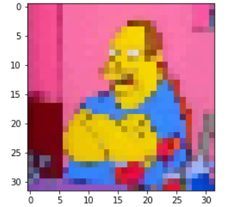
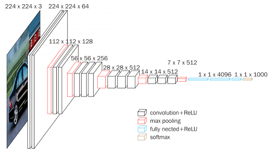
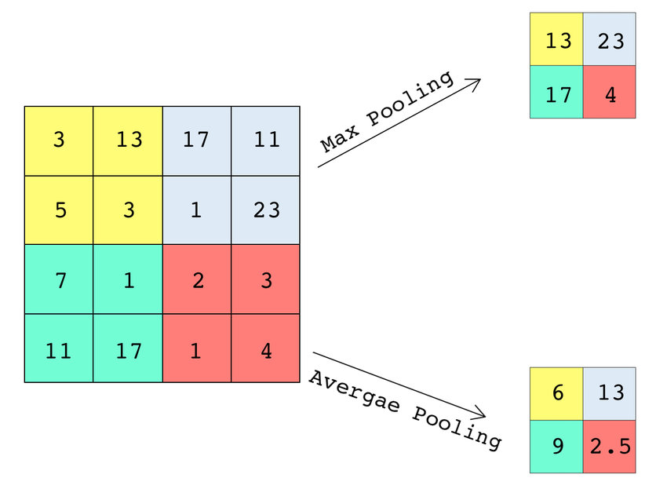

# Data Repository
https://www.kaggle.com/alexattia/the-simpsons-characters-dataset

# Required Installations
1. pip install requests  
2. pip install responses
3. pip install ipywidgets (https://ipywidgets.readthedocs.io/en/latest/user_install.html)
4. pip install voila

